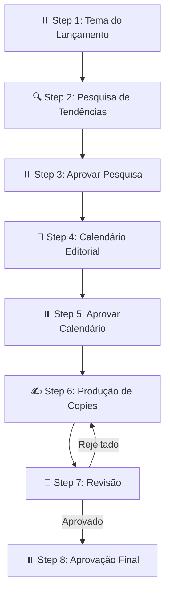

# 🚀 Walkthrough — OpenSquad + Bolão Pro (Lançamento Instagram)

## O que foi feito

Integramos o framework **OpenSquad** (multi-agent orchestration) ao projeto Bolão Pro para automatizar a produção de conteúdo de lançamento no Instagram.

---

## 1. Instalação do OpenSquad

Clonamos o repositório [opensquad](https://github.com/renatoasse/opensquad.git) em `opensquad_temp/` e rodamos a inicialização programática:

```bash
node --input-type=module -e "import { init } from './opensquad_temp/src/init.js'; \
  await init(process.cwd(), { _skipPrompts: true, _language: 'Português (Brasil)', _ides: ['antigravity'] });"
```

### Arquivos criados pela inicialização:

| Diretório | Conteúdo |
|---|---|
| `_opensquad/core/` | Engine do pipeline runner, architect agent, prompts, best-practices |
| `_opensquad/config/` | Configuração do Playwright |
| `_opensquad/_memory/` | Contexto da empresa + preferências do usuário |
| `.agent/workflows/` | Workflow `/opensquad` para o Antigravity |
| `.agent/rules/` | Regras de contexto do OpenSquad |
| `skills/` | 11 skills instaladas (image-generator, instagram-publisher, canva, etc.) |
| `dashboard/` | Dashboard visual 2D (escritório virtual) |

---

## 2. Contexto da Empresa

Criamos o arquivo [company.md](file:///c:/Users/Andropov/Documents/Bolao/_opensquad/_memory/company.md) com todo o DNA do Bolão Pro:

- **Produto**: PWA premium de bolões de futebol
- **Visual**: Dark mode (#09090b) + Neon Green (#10b981)
- **Tom de voz**: Empolgante, competitivo, misterioso ("O Mago" 🪄)
- **Features**: 7 regras de pontuação, Tesouraria, Perguntas Bônus, Rankings ao vivo

---

## 3. Squad Criado: `lancamento-insta` 🚀

### Estrutura Completa (24 arquivos)

```
squads/lancamento-insta/
├── squad.yaml                          # Config principal
├── squad-party.csv                     # Manifesto dos 4 agentes
├── agents/
│   ├── researcher.agent.md             # 🔍 Pesquisador Pedro (165 linhas)
│   ├── strategist.agent.md             # 🧠 Estrategista Estela (155 linhas)
│   ├── copywriter.agent.md             # ✍️ Redatora Rita (172 linhas)
│   └── reviewer.agent.md               # 🧐 Revisora Renata (168 linhas)
├── pipeline/
│   ├── pipeline.yaml                   # Pipeline com 8 steps
│   ├── steps/
│   │   ├── step-01-research-focus.md   # ⏸️ Checkpoint: tema do lançamento
│   │   ├── step-02-research.md         # 🔍 Pesquisa de tendências
│   │   ├── step-03-approve-research.md # ⏸️ Checkpoint: aprovar pesquisa
│   │   ├── step-04-calendar.md         # 🧠 Calendário editorial (7 posts)
│   │   ├── step-05-approve-calendar.md # ⏸️ Checkpoint: aprovar calendário
│   │   ├── step-06-copywriting.md      # ✍️ Produção de copies
│   │   ├── step-07-review.md           # 🧐 Revisão de qualidade
│   │   └── step-08-final-approval.md   # ⏸️ Checkpoint: aprovação final
│   └── data/
│       ├── research-brief.md           # Briefing de pesquisa
│       ├── domain-framework.md         # Framework operacional
│       ├── quality-criteria.md         # Critérios de qualidade
│       ├── output-examples.md          # Exemplos de output
│       ├── anti-patterns.md            # Anti-patterns do Instagram
│       └── tone-of-voice.md            # 6 variações de tom do Mago
├── _memory/
│   ├── memories.md                     # Memória do squad (vazia)
│   └── runs.md                         # Histórico de runs (vazio)
└── output/
    └── .gitkeep
```

### Os 4 Agentes 🤖

| Agente | Função | Execução |
|---|---|---|
| 🔍 **Pesquisador Pedro** | Pesquisa tendências de Instagram, análise competitiva, mercado de bolões | Subagent (fast) |
| 🧠 **Estrategista Estela** | Cria calendário editorial de 7 posts com temas, formatos e CTAs | Inline |
| ✍️ **Redatora Rita** | Escreve copies, legendas, hashtags e briefings visuais para cada post | Subagent (powerful) |
| 🧐 **Revisora Renata** | Revisa qualidade, consistência de marca e potencial de engajamento | Inline |

### Pipeline de Execução (8 Steps)



### Tom de Voz — 6 Variações 🪄

O arquivo [tone-of-voice.md](file:///c:/Users/Andropov/Documents/Bolao/squads/lancamento-insta/pipeline/data/tone-of-voice.md) define 6 tons para o conteúdo:

| Tom | Quando Usar | Exemplo |
|---|---|---|
| 🌑 **Misterioso** | Teasers, pré-lançamento | "O Mago está chegando..." |
| 🔥 **Empolgante** | Revelações, features | "Seu bolão NUNCA mais vai ser o mesmo!" |
| ⚔️ **Competitivo** | Rankings, disputas | "No bolão do Mago, tudo pode mudar" |
| 📚 **Educativo** | Tutoriais, "como funciona" | "Dica do Mago: use Perguntas Bônus" |
| 😤 **Dor/Provocação** | Problemas do público | "Cansou de planilha? Chega." |
| ⏰ **Urgência** | Contagem regressiva | "O Brasileirão começa em 5 DIAS" |

---

## 4. Como Usar

### Para rodar o squad:

Você pode usar o comando `/opensquad` no chat e selecionar "Run an existing squad" → `lancamento-insta`.

Ou digitar diretamente:
```
/opensquad rode o squad lancamento-insta
```

### O que acontece quando roda:

1. O pipeline te pergunta qual é o **tema/ângulo** do lançamento
2. O **Pesquisador Pedro** 🔍 pesquisa tendências atuais do Instagram
3. Você **aprova a pesquisa** e define o ângulo
4. A **Estrategista Estela** 🧠 cria um **calendário de 7 posts**
5. Você **aprova o calendário**
6. A **Redatora Rita** ✍️ escreve **todas as copies** (slides, legendas, hashtags, briefings visuais)
7. A **Revisora Renata** 🧐 revisa tudo (pode mandar de volta pra Rita se necessário)
8. Você faz a **aprovação final**

### Output gerado:

O conteúdo final fica salvo em:
```
squads/lancamento-insta/output/{run-id}/
```

---

## Validação

- ✅ 24 arquivos criados com sucesso
- ✅ Squad.yaml válido com 8 steps e 4 checkpoints
- ✅ 4 agentes com todas as seções obrigatórias (120-172 linhas cada)
- ✅ Pipeline com `on_reject` no step de revisão (loop de qualidade)
- ✅ 6 materiais de referência com conteúdo específico do Bolão Pro
- ✅ Tom de voz "O Mago" integrado em todos os agentes
- ✅ Identidade visual dark + neon green referenciada nos briefings
